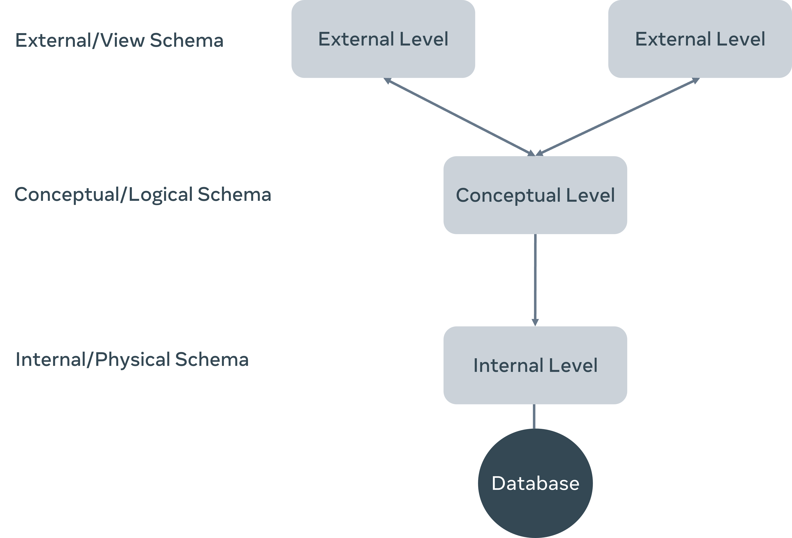

## Database schema is very important and makes the life easier for database engineers and developers.

- it will maintain a clear representation of the database and relationships.

- it will avoid reverse engineering of the underlying data model from time to time.

- it helps to write efficient quires to retrieve data for reporting and analysis.
---
## Main categories of database schema:

1- Logical schema:
- it defines entities(tables), attributes and relationships.
- it describes the structure of the database for all users.
- usually an entity relationship diagram (ER-D) is used     
- Logical schema example: 

---

2- internal or physical schema:
- it is the conversion from the logical schema to actual code that works on a specific DB platform.
- it defines how data is stored in the actual storage and the access paths, describes the physical storage of the database
- it is the actual code you write to create the database and tables.

---
3- External or view schema:
- it defines different user views.
- it describes how an external user would see it.
- ex: 
- so every user will see only the fields that are related to his field.

## So this is known as the three-schema architecture

start from external to logical then internal.

